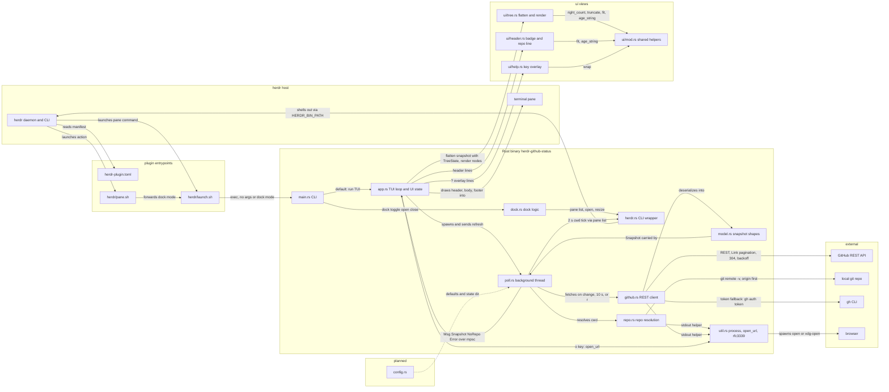

# Architecture

<!-- AUTO:GENERATED — managed by /engineering-plugin:architecture.
     Sections between AUTO:* markers are regenerated on every refresh.
     Prose outside markers (notably ## Decisions) is preserved verbatim. -->

<!-- AUTO:SUMMARY -->
`herdr-plugin-github-status` is a herdr plugin that renders a live GitHub project status (milestones, issues, PRs) in a narrow 26-column sidebar pane: herdr reads `herdr-plugin.toml` and launches `herdr/launch.sh`, which locates the `herdr-github-status` binary and either runs the ratatui TUI or forwards `dock <toggle|open|close>` (via `herdr/pane.sh`), with every host interaction going through `herdr.rs`, a typed wrapper that shells out to `$HERDR_BIN_PATH`, and `dock.rs` using those commands to find, open, and snap the sidebar to its exact width. Data flows in through a background thread: `poll.rs` ticks every 2 s, resolves the active pane's cwd via `herdr pane list`, hands it to `repo.rs` (which parses `git remote -v`, origin first, into owner/repo plus branch), and fetches on repo change, on a 10 s interval, or on an `r` refresh through `github.rs`, a ureq REST client that takes its token from `GH_TOKEN`/`GITHUB_TOKEN` or `gh auth token`, follows Link pagination and one-hop redirects, treats 304 as unchanged, and backs off on `RateLimited`. Results are shaped by `model.rs` into a `Snapshot` and delivered to `app.rs` as `Msg::{Snapshot,NoRepo,Error}` over an mpsc channel; `app.rs` now owns the UI state (cached tree `nodes`, cursor, scroll, help flag, body rect), handles keys and mouse (j/k, Enter/Space toggle, arrows collapse/expand, Tab section jumps, g/G, paging, `o` open in browser, `r`, `?`, click/wheel), and composes header, body, and footer. Rendering lives in the new `ui/` module: `ui/tree.rs` flattens the snapshot into a width-independent `Vec<Node>` driven by a `TreeState` of toggled nodes (sections, milestones, issues, closed and recently-closed groups, open PRs) and renders each node to a `Line` at a given width, `ui/header.rs` draws the badge, repo, branch, refresh age and no-token/error markers, `ui/help.rs` is the `?` overlay, and `ui/mod.rs` holds shared helpers (`right_count`, `truncate`, `fit`, `wrap`, `age_string`). `util.rs` provides the shared `stdout` process helper plus `open_url` (spawns `open`/`xdg-open` with a reaper thread) and `parse_rfc3339`; only `config.rs` (issue #8) remains planned, and later issues will add PR checks / a Now section, Actions runs, and an activity feed to the existing modules.
<!-- /AUTO:SUMMARY -->

<!-- AUTO:DIAGRAM -->

<!-- /AUTO:DIAGRAM -->

<!-- AUTO:COMPONENTS -->
## Components

| Component | Purpose | Key files |
|---|---|---|
| Plugin manifest | Declares pane `status`, actions `open`/`close`/`toggle`, build step, and future event hooks | `herdr-plugin.toml` |
| Launch wrapper | Single entrypoint: fixes PATH, finds the binary (`bin/` then `target/release/`), runs the TUI or forwards `dock <mode>` | `herdr/launch.sh` |
| Action wrapper | Thin shim herdr invokes for actions; delegates to `launch.sh` with the dock mode | `herdr/pane.sh` |
| Crate manifest | Workspace/crate definition and dependencies (anyhow, crossterm, ratatui, serde, serde_json, ureq) | `Cargo.toml` |
| CLI entry | Dispatches: no args runs the TUI; `dock <toggle\|open\|close>` runs actions; `sidebar-width` prints the target width | `src/main.rs` |
| TUI loop | ratatui event loop plus UI state (cached tree `nodes`, cursor, scroll, help flag, body rect); key/mouse handling (j/k, Enter/Space toggle, arrows collapse/expand, Tab section jumps, g/G, paging, `o` open in browser, `r`, `?`, click/wheel); composes header, body, and footer from `ui/` | `src/app.rs` |
| Dock logic | Sidebar width, split-target selection, open plus exact-width snap, per-tab detection of existing status panes via `pane process-info` | `src/dock.rs` |
| herdr CLI wrapper | Typed wrapper over `$HERDR_BIN_PATH` JSON commands (pane list/layout/resize/rename/close, plugin pane open, agent list) with typed errors | `src/herdr.rs` |
| Repo resolution | cwd to owner/repo and branch by parsing `git remote -v` (origin first) | `src/repo.rs` |
| GitHub client | ureq REST client: token from `GH_TOKEN`/`GITHUB_TOKEN` or `gh auth token`, Link pagination, 304 handling, rate-limit backoff via a `RateLimited` error, one-hop redirect follow | `src/github.rs` |
| Snapshot model | `Milestone`, `Issue`, `PullRequest` shapes plus the `Snapshot` aggregate | `src/model.rs` |
| Poller | Background thread: 2 s cwd tick via `herdr pane list`, fetch on repo change / 10 s interval / `r` refresh; sends `Msg::{Snapshot,NoRepo,Error}` over an mpsc channel | `src/poll.rs` |
| Utilities | Shared `stdout(program, args, cwd)` process helper used by `repo.rs` and `github.rs`; `open_url` spawns `open`/`xdg-open` with a reaper thread for the `o` key; `parse_rfc3339` for GitHub timestamps | `src/util.rs` |
| UI helpers | Shared rendering helpers for the 26-column pane: `right_count`, `truncate`, `fit`, `wrap`, `age_string` | `src/ui/mod.rs` |
| Tree view | Width-independent `flatten(snapshot, state, now) -> Vec<Node>` driven by a `TreeState` of toggled nodes (sections → milestones → issues, closed-milestone and recently-closed groups, open PRs) plus per-node `render(node, w) -> Line` | `src/ui/tree.rs` |
| Header | Badge, repo, branch, refresh age, and no-token/error markers | `src/ui/header.rs` |
| Help overlay | The `?` key overlay listing key bindings | `src/ui/help.rs` |
| Config | (planned) config file plus defaults; state dir persistence (issue #8) | `src/config.rs` |
<!-- /AUTO:COMPONENTS -->

## Decisions

## Generated

<!-- AUTO:META -->
Last refreshed: 2026-09-04 04:20
Triggered by: issue-close #3
Diagram type: flowchart
Source-of-truth: REQUIREMENTS.md ## Architecture + code structure scan
<!-- /AUTO:META -->
