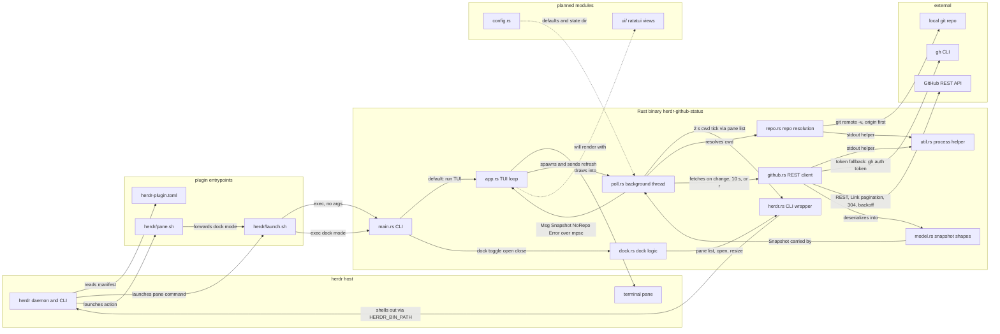

# Architecture

<!-- AUTO:GENERATED — managed by /engineering-plugin:architecture.
     Sections between AUTO:* markers are regenerated on every refresh.
     Prose outside markers (notably ## Decisions) is preserved verbatim. -->

<!-- AUTO:SUMMARY -->
`herdr-plugin-github-status` is a herdr plugin that renders a live GitHub project status (milestones, issues, PRs) in a narrow 26-column sidebar pane. herdr reads `herdr-plugin.toml` and launches `herdr/launch.sh`, which locates the `herdr-github-status` binary and either runs the ratatui TUI (pane) or forwards `dock <toggle|open|close>` (actions via `herdr/pane.sh`). The binary never talks to herdr's socket directly; every host interaction goes through `herdr.rs`, a typed wrapper that shells out to `$HERDR_BIN_PATH` and parses its JSON, while `dock.rs` uses those commands to find, open, and snap the sidebar to its exact width. Data flows in through a background thread: `poll.rs` ticks every 2 s, resolves the active pane's cwd via `herdr pane list`, hands it to `repo.rs` (which parses `git remote -v`, origin first, into owner/repo plus branch), and fetches on repo change, on a 10 s interval, or on an `r` refresh. `github.rs` is a ureq REST client that takes its token from `GH_TOKEN`/`GITHUB_TOKEN` or `gh auth token`, follows Link pagination and one-hop redirects, treats 304 as unchanged, and backs off on a `RateLimited` error; results are shaped by `model.rs` into a `Snapshot` and delivered to `app.rs` as `Msg::{Snapshot,NoRepo,Error}` over an mpsc channel, where the header plus MILESTONES / ISSUES / PULL REQUESTS sections are rendered. `util.rs` holds the shared `stdout(program, args, cwd)` process helper used by both `repo.rs` and `github.rs`. The richer `ui/` views (tree, activity feed, help overlay) and `config.rs` are planned for later issues and are not yet in the tree.
<!-- /AUTO:SUMMARY -->

<!-- AUTO:DIAGRAM -->

<!-- /AUTO:DIAGRAM -->

<!-- AUTO:COMPONENTS -->
## Components

| Component | Purpose | Key files |
|---|---|---|
| Plugin manifest | Declares pane `status`, actions `open`/`close`/`toggle`, build step, and future event hooks | `herdr-plugin.toml` |
| Launch wrapper | Single entrypoint: fixes PATH, finds the binary (`bin/` then `target/release/`), runs the TUI or forwards `dock <mode>` | `herdr/launch.sh` |
| Action wrapper | Thin shim herdr invokes for actions; delegates to `launch.sh` with the dock mode | `herdr/pane.sh` |
| Crate manifest | Workspace/crate definition and dependencies (anyhow, crossterm, ratatui, serde, serde_json, ureq) | `Cargo.toml` |
| CLI entry | Dispatches: no args runs the TUI; `dock <toggle\|open\|close>` runs actions; `sidebar-width` prints the target width | `src/main.rs` |
| TUI loop | ratatui layout, quit keys, mouse capture; consumes poll messages and renders header plus MILESTONES / ISSUES / PULL REQUESTS sections | `src/app.rs` |
| Dock logic | Sidebar width, split-target selection, open plus exact-width snap, per-tab detection of existing status panes via `pane process-info` | `src/dock.rs` |
| herdr CLI wrapper | Typed wrapper over `$HERDR_BIN_PATH` JSON commands (pane list/layout/resize/rename/close, plugin pane open, agent list) with typed errors | `src/herdr.rs` |
| Repo resolution | cwd to owner/repo and branch by parsing `git remote -v` (origin first) | `src/repo.rs` |
| GitHub client | ureq REST client: token from `GH_TOKEN`/`GITHUB_TOKEN` or `gh auth token`, Link pagination, 304 handling, rate-limit backoff via a `RateLimited` error, one-hop redirect follow | `src/github.rs` |
| Snapshot model | `Milestone`, `Issue`, `PullRequest` shapes plus the `Snapshot` aggregate | `src/model.rs` |
| Poller | Background thread: 2 s cwd tick via `herdr pane list`, fetch on repo change / 10 s interval / `r` refresh; sends `Msg::{Snapshot,NoRepo,Error}` over an mpsc channel | `src/poll.rs` |
| Process helper | Shared `stdout(program, args, cwd)` helper used by `repo.rs` and `github.rs` | `src/util.rs` |
| UI views | (planned) ratatui rendering: section tree, activity feed, help overlay; 26-column-aware truncation (issues #3–#6) | `src/ui/` |
| Config | (planned) config file plus defaults; state dir persistence (issue #8) | `src/config.rs` |
<!-- /AUTO:COMPONENTS -->

## Decisions

## Generated

<!-- AUTO:META -->
Last refreshed: 2026-09-04 02:55
Triggered by: issue-close #2
Diagram type: flowchart
Source-of-truth: REQUIREMENTS.md ## Architecture + code structure scan
<!-- /AUTO:META -->
