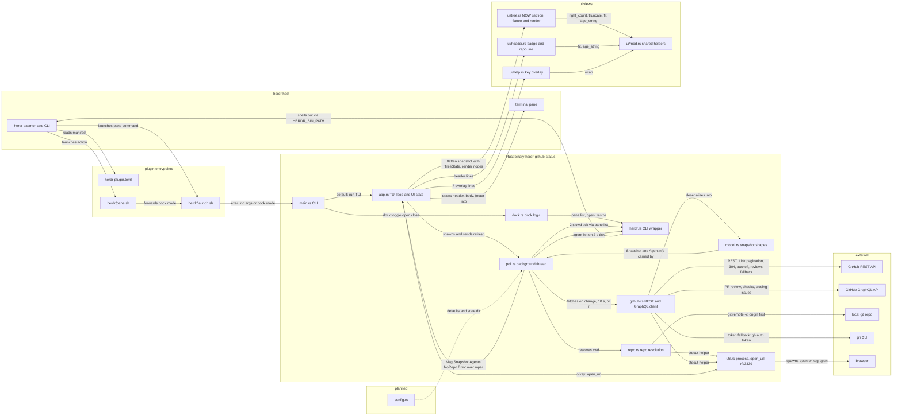

# Architecture

<!-- AUTO:GENERATED — managed by /engineering-plugin:architecture.
     Sections between AUTO:* markers are regenerated on every refresh.
     Prose outside markers (notably ## Decisions) is preserved verbatim. -->

<!-- AUTO:SUMMARY -->
`herdr-plugin-github-status` is a herdr plugin that renders a live GitHub project status (a NOW section, milestones, issues, PRs) in a narrow 26-column sidebar pane: herdr reads `herdr-plugin.toml` and launches `herdr/launch.sh`, which runs the ratatui TUI or forwards `dock <toggle|open|close>` (via `herdr/pane.sh`), with `dock.rs` and every other host interaction going through `herdr.rs`, a typed wrapper over `$HERDR_BIN_PATH`. A background thread in `poll.rs` ticks every 2 s, resolves the active pane's cwd (via `herdr pane list`) into owner/repo plus branch through `repo.rs`, polls `herdr agent list` for workspace agents, and fetches on repo change, on a 10 s interval, or on an `r` refresh through `github.rs`, a ureq REST + GraphQL client that takes its token from `GH_TOKEN`/`GITHUB_TOKEN` or `gh auth token`, follows Link pagination and one-hop redirects, treats 304 as unchanged, and backs off on `RateLimited`. Each refresh runs one GraphQL query that enriches open PRs with review decision, checks rollup, and closing issues, with a REST `/pulls/{n}/reviews` fallback for the current branch's PR when unauthenticated. `model.rs` shapes results into a `Snapshot` (`Milestone`, `Issue`, `PullRequest` plus `PrExtra`/`Checks`, `Review`/`review_decision`, `closing_refs`, and `AgentInfo`) delivered to `app.rs` as `Msg::{Snapshot,Agents,NoRepo,Error}` over an mpsc channel, where `app.rs` owns UI state, handles keys and mouse, and composes header, body, and footer. `ui/tree.rs` flattens the snapshot into a width-independent `Vec<Node>` driven by a `TreeState` (NOW section with the active issue, the current branch's PR with a review/checks tail, and workspace agents; milestones; expandable PR nodes; recently merged/closed group) and renders each node to a `Line`, `ui/header.rs`, `ui/help.rs`, and `ui/mod.rs` supply the header, `?` overlay, and shared helpers, `util.rs` provides `stdout`, `open_url`, and `parse_rfc3339`, and only `config.rs` (issue #8) remains planned, with later issues adding Actions runs and an activity feed.
<!-- /AUTO:SUMMARY -->

<!-- AUTO:DIAGRAM -->

<!-- /AUTO:DIAGRAM -->

<!-- AUTO:COMPONENTS -->
## Components

| Component | Purpose | Key files |
|---|---|---|
| Plugin manifest | Declares pane `status`, actions `open`/`close`/`toggle`, build step, and future event hooks | `herdr-plugin.toml` |
| Launch wrapper | Single entrypoint: fixes PATH, finds the binary (`bin/` then `target/release/`), runs the TUI or forwards `dock <mode>` | `herdr/launch.sh` |
| Action wrapper | Thin shim herdr invokes for actions; delegates to `launch.sh` with the dock mode | `herdr/pane.sh` |
| Crate manifest | Workspace/crate definition and dependencies (anyhow, crossterm, ratatui, serde, serde_json, ureq) | `Cargo.toml` |
| CLI entry | Dispatches: no args runs the TUI; `dock <toggle\|open\|close>` runs actions; `sidebar-width` prints the target width | `src/main.rs` |
| TUI loop | ratatui event loop plus UI state (cached tree `nodes`, cursor, scroll, help flag, body rect); key/mouse handling (j/k, Enter/Space toggle, arrows collapse/expand, Tab section jumps, g/G, paging, `o` open in browser, `r`, `?`, click/wheel); composes header, body, and footer from `ui/` | `src/app.rs` |
| Dock logic | Sidebar width, split-target selection, open plus exact-width snap, per-tab detection of existing status panes via `pane process-info` | `src/dock.rs` |
| herdr CLI wrapper | Typed wrapper over `$HERDR_BIN_PATH` JSON commands (pane list/layout/resize/rename/close, plugin pane open) with typed errors; `agent_list` returns the workspace's running agents for the NOW section | `src/herdr.rs` |
| Repo resolution | cwd to owner/repo and branch by parsing `git remote -v` (origin first) | `src/repo.rs` |
| GitHub client | ureq REST + GraphQL client: token from `GH_TOKEN`/`GITHUB_TOKEN` or `gh auth token`, Link pagination, 304 handling, rate-limit backoff via a `RateLimited` error, one-hop redirect follow; one GraphQL query per refresh enriches open PRs (review decision, checks rollup, closing issues), with a REST `/pulls/{n}/reviews` fallback for the current branch's PR when unauthenticated | `src/github.rs` |
| Snapshot model | `Milestone`, `Issue`, `PullRequest` shapes plus the `Snapshot` aggregate; `PrExtra`/`Checks` (`PrExtra::from_graphql`, `Checks::from_rollup`), `Review`/`review_decision`, `closing_refs` body parsing, and `AgentInfo` | `src/model.rs` |
| Poller | Background thread: 2 s tick resolves cwd via `herdr pane list` and polls `herdr agent list`, sending `Msg::Agents` on change; fetch on repo change / 10 s interval / `r` refresh; sends `Msg::{Snapshot,Agents,NoRepo,Error}` over an mpsc channel | `src/poll.rs` |
| Utilities | Shared `stdout(program, args, cwd)` process helper used by `repo.rs` and `github.rs`; `open_url` spawns `open`/`xdg-open` with a reaper thread for the `o` key; `parse_rfc3339` for GitHub timestamps | `src/util.rs` |
| UI helpers | Shared rendering helpers for the 26-column pane: `right_count`, `truncate`, `fit`, `wrap`, `age_string` | `src/ui/mod.rs` |
| Tree view | Width-independent `flatten(snapshot, state, now) -> Vec<Node>` driven by a `TreeState` of toggled nodes: a NOW section (active issue from branch `issue-<n>-*` or the current branch's PR, that PR with a review/checks tail, workspace agents), sections → milestones → issues, closed-milestone group, expandable PR nodes, and a recently merged/closed group; plus per-node `render(node, w) -> Line` | `src/ui/tree.rs` |
| Header | Badge, repo, branch, refresh age, and no-token/error markers | `src/ui/header.rs` |
| Help overlay | The `?` key overlay listing key bindings | `src/ui/help.rs` |
| Config | (planned) config file plus defaults; state dir persistence (issue #8) | `src/config.rs` |
<!-- /AUTO:COMPONENTS -->

## Decisions

## Generated

<!-- AUTO:META -->
Last refreshed: 2026-09-04 05:45
Triggered by: issue-close #4
Diagram type: flowchart
Source-of-truth: REQUIREMENTS.md ## Architecture + code structure scan
<!-- /AUTO:META -->
