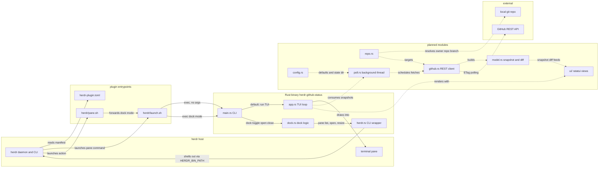

# Architecture

<!-- AUTO:GENERATED — managed by /engineering-plugin:architecture.
     Sections between AUTO:* markers are regenerated on every refresh.
     Prose outside markers (notably ## Decisions) is preserved verbatim. -->

<!-- AUTO:SUMMARY -->
`herdr-plugin-github-status` is a herdr plugin that renders a live GitHub project status (milestones, issues, PRs, Actions) in a narrow 26-column sidebar pane. herdr reads `herdr-plugin.toml` and launches `herdr/launch.sh`, which locates the `herdr-github-status` binary and either runs the ratatui TUI (pane) or forwards `dock <toggle|open|close>` (actions via `herdr/pane.sh`). The binary never talks to herdr's socket directly; every host interaction goes through `herdr.rs`, a typed wrapper that shells out to `$HERDR_BIN_PATH` and parses its JSON, while `dock.rs` uses those commands to find, open, and snap the sidebar to its exact width. The current scaffold (main/app/dock/herdr) is verified against herdr 0.8.0; the GitHub client, snapshot model, background poller, richer UI, and config modules are planned for later milestones and are not yet in the tree.
<!-- /AUTO:SUMMARY -->

<!-- AUTO:DIAGRAM -->

<!-- /AUTO:DIAGRAM -->

<!-- AUTO:COMPONENTS -->
## Components

| Component | Purpose | Key files |
|---|---|---|
| Plugin manifest | Declares pane `status`, actions `open`/`close`/`toggle`, build step, and future event hooks | `herdr-plugin.toml` |
| Launch wrapper | Single entrypoint: fixes PATH, finds the binary (`bin/` then `target/release/`), runs the TUI or forwards `dock <mode>` | `herdr/launch.sh` |
| Action wrapper | Thin shim herdr invokes for actions; delegates to `launch.sh` with the dock mode | `herdr/pane.sh` |
| Crate manifest | Workspace/crate definition and dependencies (ratatui, crossterm, serde, serde_json, anyhow) | `Cargo.toml` |
| CLI entry | Dispatches: no args runs the TUI; `dock <toggle\|open\|close>` runs actions; `sidebar-width` prints the target width | `src/main.rs` |
| TUI loop | ratatui header/body/footer layout, quit keys, mouse capture | `src/app.rs` |
| Dock logic | Sidebar width, split-target selection, open plus exact-width snap, per-tab detection of existing status panes via `pane process-info` | `src/dock.rs` |
| herdr CLI wrapper | Typed wrapper over `$HERDR_BIN_PATH` JSON commands (pane list/layout/resize/rename/close, plugin pane open, agent list) with typed errors | `src/herdr.rs` |
| Repo resolution | (planned) cwd to owner/repo and branch via git | `src/repo.rs` |
| GitHub client | (planned) ureq REST client with ETag cache and rate-limit tracking; fetches milestones, issues, PRs, workflow runs, check runs | `src/github.rs` |
| Snapshot model | (planned) normalized snapshot; diff of consecutive snapshots yields activity events | `src/model.rs` |
| Poller | (planned) background thread scheduling fetches; sends snapshots over a channel | `src/poll.rs` |
| UI views | (planned) ratatui rendering: header, section tree, activity feed, help overlay; 26-column-aware truncation | `src/ui/` |
| Config | (planned) config file plus defaults; state dir persistence | `src/config.rs` |
<!-- /AUTO:COMPONENTS -->

## Decisions

## Generated

<!-- AUTO:META -->
Last refreshed: 2026-09-04 01:50
Triggered by: issue-close #1
Diagram type: flowchart
Source-of-truth: REQUIREMENTS.md ## Architecture + code structure scan
<!-- /AUTO:META -->
